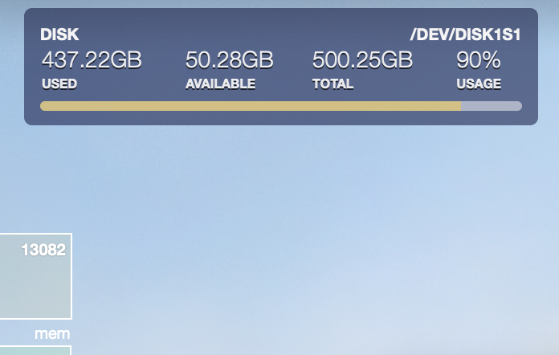

# Disk Usage bar widget

This is a small disk usage meter widget for [Übersicht](http://tracesof.net/uebersicht/).
Design was inspired by [Memory Bar](https://github.com/cobyism/ubersicht-memory-bar), by cobyism.

## Screenshot

## The disk info seems to be wrong?
Check `df -l` and find the disk you want to show.
Open index.coffee script, and set the `disk_index` variable to the line index of the disk (beginning from 1 for the first disk).

On Catalina, the index seems to be 2 for the main disk (which is default). If you are using the older OS, it should be 1.

## Download

Clone or download this repo and unzip the archive in Ubersicht widgets folder.

## License

[MIT](./LICENSE)
